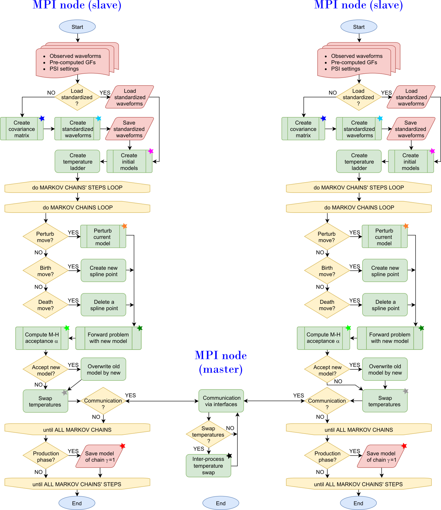

# HPC-parallelized Bayesian Parametric Slip Inversion (PSI)
Transdimensional Bayesian inversion to infer kinematic finite-extent fault models for large earthquakes
***************************************
  
  A unique software package for Parametric Slip Inversion (PSI) of earthquake fault-slip models within a full Bayesian framework (Hallo and Gallovic, 2020). The framework is designed as transdimensional and data-driven, meaning the model complexity is inferred directly from the data. This is implemented by a mathematical **Occam's razor** inherent to the Bayesian formulation. The transdimensional model space is sampled using **Markov Chain Monte Carlo** (MCMC) with **Parallel Tempering**, enabling efficient exploration of high-dimensional and non-linear parameter spaces. The code is parallelized in **Fortran** using **MPI** (CPU), specifically optimized for deployment on **High-Performance Computing** (HPC) clusters and large-scale seismic inversions.

1 METHODOLOGY
===================

  Hallo, M., Gallovic, F. (2020). Bayesian self-adapting fault slip
inversion with Green's functions uncertainty and application on the
2016 Mw7.1 Kumamoto earthquake, Journal of Geophysical Research: 
Solid Earth, 125, e2019JB018703. [https://doi.org/10.1029/2019JB018703](https://doi.org/10.1029/2019JB018703)

2 TECHNICAL IMPLEMENTATION
===================

Bayesian Inference, Markov Chain Monte Carlo (MCMC), Uncertainty Quantification,
High-Performance Computing (HPC), Code Parallelization by MPI (CPU), Transdimensional Bayesian Inference, 
Data-driven Inversion, Occam's razor

The official software version is archived on Zenodo:

[](https://doi.org/10.5281/zenodo.19343665)

3 RELEASE HISTORY (MAJOR VERSIONS)
===================

*   **2.0 (Dawn) — Numerical Engine Revision** | December 2019
    *   Enhanced Occam's Razor: Improved Bayesian model selection logic to more effectively infer optimal model complexity from observed data
    *   Memory Optimization: Implemented REAL4 (Fortran) precision for covariance matrices, significantly reducing memory footprint for large-scale HPC inversions
    *   Advanced Visualization: New 2D fault-surface plotting tools for posterior distributions
    *   Key Publication: Core implementation used by paper published in Journal of Geophysical Research: Solid Earth (Hallo and Gallovic, 2020)

*   **1.0 (Chasm) — Initial Release** | January 2018
    *   This version served as the core computational framework for the author's PhD thesis

4 REQUIREMENTS
===================

  1. Compiled `pt.f90`
     * Parallel Tempering library (M.Sambridge)
     * [http://www.iearth.edu.au/codes/ParallelTempering/](http://www.iearth.edu.au/codes/ParallelTempering/)
    
  2. Compiled `time_2d.c` 
     * Finite-differences computation of 2D travel time library (P.Podvin)
     * [https://github.com/fgallovic/RIKsrf/blob/master/src-RIKsrf/Time_2d.c](https://github.com/fgallovic/RIKsrf/blob/master/src-RIKsrf/Time_2d.c)
    
  3. Compiled `gr_nez.for` and `cnv_nez.for`
     * Discrete wavenumber method for Green's functions computation (M.Bouchon)
     * [https://github.com/fgallovic/LinSlipInv/tree/master/src-dwn](https://github.com/fgallovic/LinSlipInv/tree/master/src-dwn)
    
  4. LINUX/UNIX machine with `LAPACK` or `MKL` libraries
  
  5. Fortran90 (`gfortran` or `ifort`) and MPI (`mpif90` or `mpiifort`) compilers
  
  6. MATLAB R2016b or newer for plotting results

5 PACKAGE CONTENT
===================

  1. `dwn` - Directory containing Green's functions computation
  2. `examples` - Directory containing examples of input files
  3. `input` - Directory with input files
  4. `inv` - Work directory for the ongoing inversion
  5. `lib` - Directory with compiled libraries and additional functions
  6. `src` - Directory with source codes of the PSI (includes `Makefile`)
  7. `plot_prepare.m` - Plots prepared suf-faults for Green's functions
  8. `plot_psi_fit.m` - Plots final data fit
  9. `plot_psi_model.m` - Plots final fault-slip model
  10. `plot_psi_posteriorPDF.m` - Plots ensemble statistics
  11. `run_psi.sh` - Run the PSI inversion
  12. `run_res.sh` - Run post-processing of the PSI inversion

6 COMPILATION
===================

  1. Compile Green's functions computation codes in the `dwn` folder
  2. Copy the required third-party `PT` and `Time_2d` libraries into `lib` folder
  3. Set your compilers in `Makefile` in the `src` folder and type:
```bash
make
```
  4. Check `stations`, `prepare`, `waves`, `psi_sp`, `psi_ap`, and `psi_pp` binary programs in the project root directory
   
7 USAGE
===================

  1. Set input parameters into files of the `input` folder
  2. Run `./stations` to prepare list of stations in X,Y coordinates (or prepare it manually)
  3. Run `./prepare` to prepare input files for Green's functions computation
  4. Compute Green's functions and copy `NEZsor.dat` into PSI root folder
  5. Prepare observed data into `NEZwave.dat` file in the PSI root folder (ASCII file)
  6. Run `./waves` to prepare vector of observed data `var_Unez.tmp`
  7. Execute PSI inversion using  `./run_psi.sh` bash script
  8. Execute PSI post-processing using  `./run_res.sh` bash script
  9. Plot and see results in the `inv` folder by MATLAB scripts in the PSI root folder
  
  Note: See connected example files for the structure of ASCII input files and observed data
  
  The flowchart below illustrates the Master-Slave (Manager-Worker) paradigm implemented via MPI. 
  A dedicated Master node coordinates the communication and task distribution (Parallel Tempering 
  swaps), while multiple Worker nodes perform independent MCMC sampling in parallel to 
  maximize HPC throughput.

<picture>
  <source media="(prefers-color-scheme: dark)" srcset="img/PSI.png">
  <source media="(prefers-color-scheme: light)" srcset="img/PSI.png">
  
</picture>

8 COPYRIGHT
===================

Copyright (C) 2017-2019  Miroslav Hallo and Frantisek Gallovic

This program is published under the GNU General Public License (GNU GPL).

This program is free software: you can modify it and/or redistribute it
or any derivative version under the terms of the GNU General Public
License as published by the Free Software Foundation, either version 3
of the License, or (at your option) any later version.

This code is distributed in the hope that it will be useful, but WITHOUT
ANY WARRANTY. We would like to kindly ask you to acknowledge the authors
and don't remove their names from the code.

You should have received copy of the GNU General Public License along
with this program. If not, see <http://www.gnu.org/licenses/>.